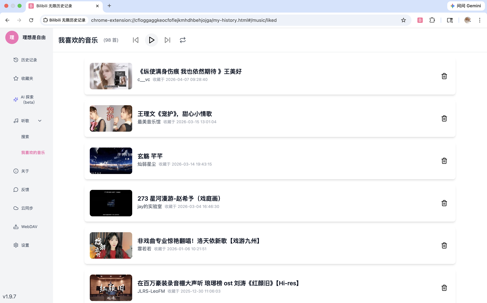
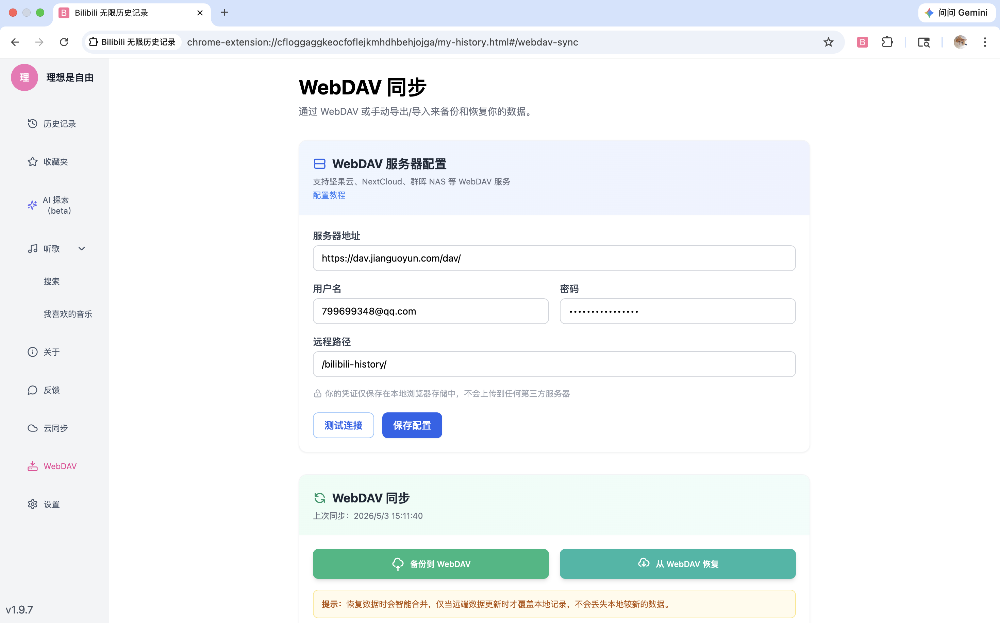

<div align="center">
  

  <h1>Bilibili 无限历史记录</h1>

  <p>
    <b>不限量保存与管理你的 B 站观看历史、收藏夹与喜欢的音乐</b>
    <br/>
    支持 WebDAV / 自建云端双向同步 · AI 语义搜索 · Chrome / Edge / Firefox 全平台
  </p>

  <p>
    <a href="https://github.com/mundane799699/bilibili-history-wxt/stargazers">
      
    </a>
    <a href="https://github.com/mundane799699/bilibili-history-wxt/releases">
      
    </a>
    <a href="https://chromewebstore.google.com/detail/bilibili-%E6%97%A0%E9%99%90%E5%8E%86%E5%8F%B2%E8%AE%B0%E5%BD%95/cfloggaggkeocfoflejkmhdhbehjojga">
      
    </a>
    <a href="LICENSE">
      
    </a>
  </p>

  <p>
    <a href="https://bilibilihistory.com"><b>官网</b></a> ·
    <a href="https://www.bilibili.com/video/BV1PALHzREm1"><b>演示视频</b></a> ·
    <a href="#安装">安装</a> ·
    <a href="#功能特性">功能</a> ·
    <a href="#本地开发">开发</a>
  </p>
</div>

---

## 简介

B 站官方网页端只保留**最近 3 个月**的观看历史，超出后无法再找回。

**Bilibili 无限历史记录**是一个浏览器扩展，通过本地 IndexedDB 永久保存你的全部 B 站观看历史、收藏夹与"喜欢的音乐"，并提供 WebDAV / 自建云端双向同步 与 AI 语义搜索，让"想再看一次的视频"永远不再丢失。

## 功能特性

- **永久保存** — 自动同步并永久保留全部 B 站观看历史，彻底告别 3 个月限制
- **收藏夹备份** — 支持收藏夹与"喜欢的音乐"全量 + 增量同步，本地随时可查
- **WebDAV 双向同步** — 与坚果云 / 自建 WebDAV 互通，多设备智能合并不丢数据
- **AI 语义搜索** — 接入阿里云百炼 DashScope，用自然语言找回模糊记忆中的视频
- **网页端联动** — 在 B 站网页上删除历史会同步删除插件本地记录
- **多浏览器支持** — Chrome / Edge / Firefox 全平台覆盖
- **隐私优先** — 数据默认仅存在本地，是否上传云端完全由你决定

## 安装

| 浏览器  | 商店地址                                                                                                                                                            |
| ------- | ------------------------------------------------------------------------------------------------------------------------------------------------------------------- |
| Chrome  | [Chrome Web Store](https://chromewebstore.google.com/detail/bilibili-%E6%97%A0%E9%99%90%E5%8E%86%E5%8F%B2%E8%AE%B0%E5%BD%95/cfloggaggkeocfoflejkmhdhbehjojga?hl=zh) |
| Edge    | [Edge Add-ons](https://microsoftedge.microsoft.com/addons/detail/ekdaecpdimflnhalemibjjjdfoplnbna)                                                                  |
| Firefox | [Firefox Add-ons](https://addons.mozilla.org/zh-CN/firefox/addon/bilibili-%E6%97%A0%E9%99%90%E5%8E%86%E5%8F%B2%E8%AE%B0%E5%BD%95/)                                  |

## 截图演示

<table>
  <tr>
    <td width="50%"></td>
    <td width="50%"></td>
  </tr>
  <tr>
    <td align="center"><sub><b>历史记录</b></sub></td>
    <td align="center"><sub><b>收藏夹</b></sub></td>
  </tr>
  <tr>
    <td width="50%"></td>
    <td width="50%"></td>
  </tr>
  <tr>
    <td align="center"><sub><b>喜欢的音乐</b></sub></td>
    <td align="center"><sub><b>WebDAV 同步</b></sub></td>
  </tr>
</table>

> 完整演示请看 [B 站演示视频](https://www.bilibili.com/video/BV1PALHzREm1)

## 使用方法

1. 登录 [B 站网页版](https://www.bilibili.com)
2. 安装扩展后，点击浏览器工具栏中的扩展图标
3. 首次点击「立即同步」会全量同步你的 Bilibili 观看历史
4. 同步完成后，点击「打开历史记录页面」即可查看全部记录
5. 使用搜索框检索特定记录，向下滚动加载更多

## 技术栈

- [WXT](https://wxt.dev) — 现代化跨浏览器扩展框架
- [React 19](https://react.dev) + [TailwindCSS 3](https://tailwindcss.com)
- [TypeScript](https://www.typescriptlang.org) + [Zustand](https://github.com/pmndrs/zustand)
- IndexedDB · `browser.alarms` · `declarativeNetRequest`

## 本地开发

```bash
# 1. 安装 pnpm
npm install -g pnpm

# 2. 安装依赖（postinstall 会自动跑 wxt prepare）
pnpm install

# 3. 启动开发模式
pnpm dev              # Chrome
pnpm dev:firefox      # Firefox
```

加载本地扩展：Chrome 打开 `chrome://extensions/` → 加载已解压扩展程序 → 选择 `.output/chrome-mv3-dev`。

| 命令           | 说明                |
| -------------- | ------------------- |
| `pnpm dev`     | Chrome 开发模式     |
| `pnpm build`   | 生产构建            |
| `pnpm zip`     | 打包上架 zip        |
| `pnpm compile` | TypeScript 类型检查 |
| `pnpm format`  | Prettier 格式化     |

## 参与贡献

欢迎 Issue 与 PR！如果你想深入参与开发，可加我微信详聊（请备注 **参与开发**）：


## Star History

<a href="https://star-history.com/#mundane799699/bilibili-history-wxt&Date">
  
</a>

## License

本项目基于 [MIT License](LICENSE) 开源。

---

<div align="center">
  <sub>如果这个项目对你有帮助，欢迎点一个 ⭐ Star 支持作者持续更新</sub>
</div>
